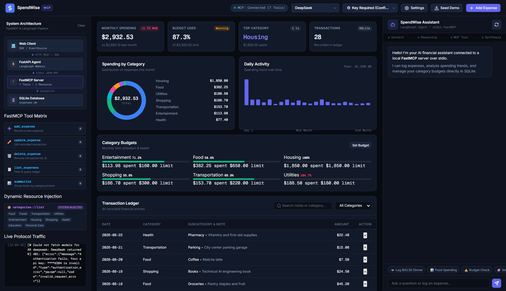

# SpendWise AI — Agentic MCP Expense Tracker

A showcase project demonstrating **Agentic AI Engineering** using the **Model Context Protocol (MCP)**, **FastAPI**, and **LangChain / LangGraph**.

SpendWise pairs a local FastMCP tool server with a real-time single-screen **Financial Intelligence & Agent Observability Dashboard** served directly by FastAPI with zero build steps.



---

## 🚀 Quickstart (Single Command)

### Prerequisites
- Python ≥ 3.13
- [uv](https://docs.astral.sh/uv/) package manager
- Any LLM API Key: **DeepSeek**, **OpenAI**, or **Google Gemini** (or configure in the web UI)

```bash
# 1. Clone repository
git clone https://github.com/your-username/spendwise-mcp.git
cd spendwise-mcp

# 2. Install dependencies
uv sync

# 3. Launch application
uv run python app.py
```

Open **`http://localhost:8000`** in your browser. Configure your API key via the **⚙️ Settings** button in the header or in `.env`.

---

## 🌟 Key Highlights

- **Model Context Protocol (MCP)**: Native stdio JSON-RPC integration with a standalone `FastMCP` server exposing 7 financial tools and dynamic `categories://list` resource injection.
- **Dynamic `/models` Discovery**: Real-time model discovery from provider endpoints (DeepSeek, OpenAI, Google Gemini, OpenRouter/Custom) with client-side API key configuration.
- **Real-Time Agent Observability**: Visual system architecture topology map, live tool execution cards with latency badges, and streaming Server-Sent Events (SSE).
- **Auto-Syncing Financial Hub**: Category breakdown donut chart, daily spending trend activity, budget health progress meters, and transaction ledger that update live on agent mutations.
- **Zero-Build Architecture**: 100% Python-powered with native web standards—no Node.js or npm dependencies required.

---

## 📚 Documentation

Detailed technical references are available in the **`docs/`** directory:

- 🏛️ **[System Architecture](docs/architecture.md)** — Architectural design, stdio transport flow, LangGraph memory checkpointer, and SSE streaming pipeline.
- 🛠️ **[FastMCP Tools & Resources](docs/mcp-tools.md)** — Complete schema reference for all 7 FastMCP tools and the `categories://list` resource.
- 📡 **[REST API & SSE Reference](docs/api-reference.md)** — Specification for REST endpoints (`/api/expenses`, `/api/budgets`, `/api/models`, etc.) and the streaming event protocol.

---

## 💡 Example Prompts to Try

- 🍱 *"Log $42.50 dinner at Nobu today under Food"*
- 📊 *"How much have I spent on Food and Dining this month?"*
- ⚠️ *"Check my monthly budget status and highlight any over-budget categories"*
- 🎯 *"Set my Entertainment monthly budget to $200"*
